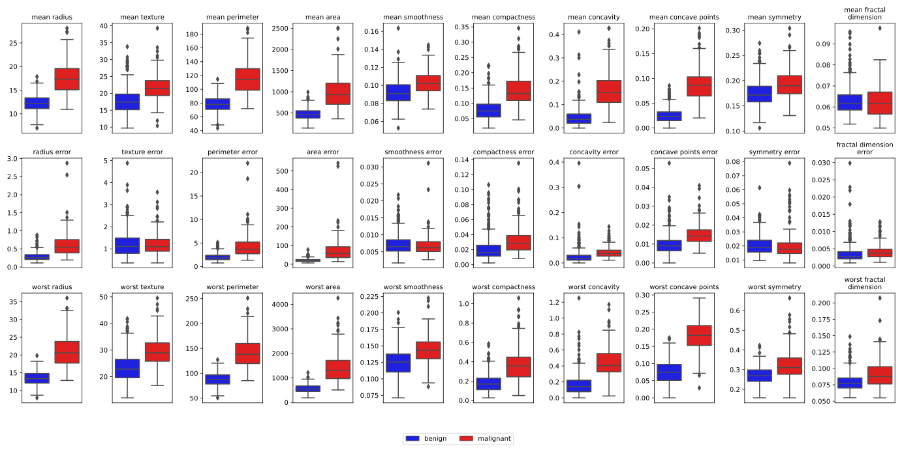

Given a numeric feature matrix and a class vector, we provide a simple function to create a boxplot of each feature w.r.t. the class vector.

The function can serve as an entry point for more complex customizations. The boxplots are based on `seaborn.boxplot`.

The following picture provides an example based on the [breast cancer dataset](https://scikit-learn.org/stable/modules/generated/sklearn.datasets.load_breast_cancer.html).

